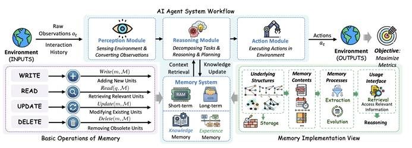
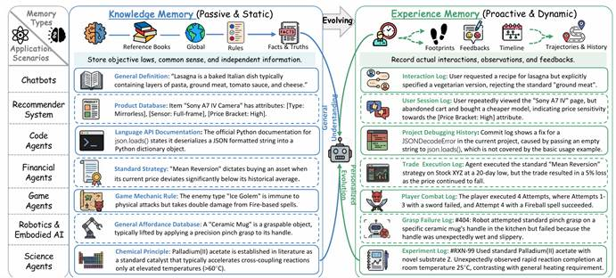
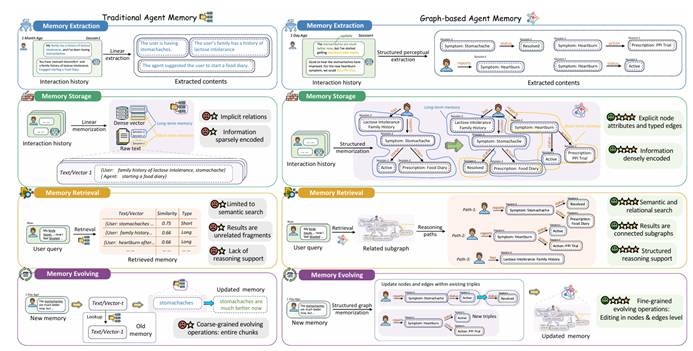
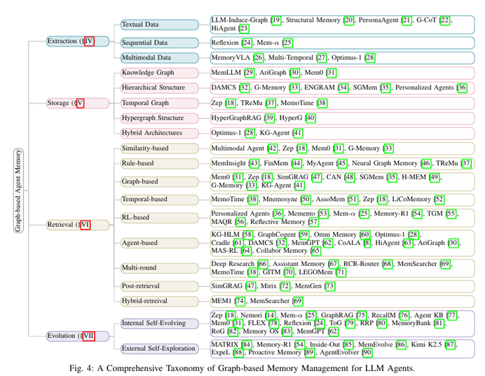
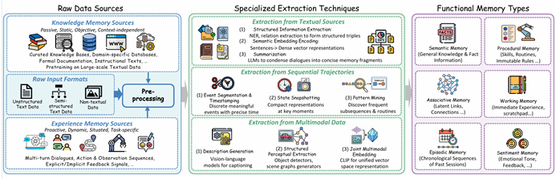
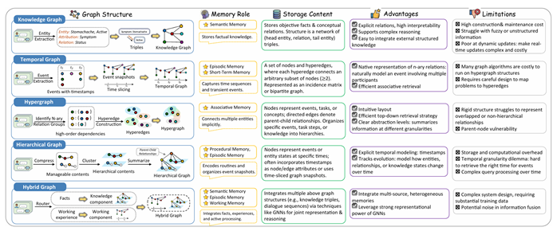
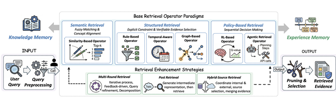

随着 AI Agent 应用的快速发展，智能体需要处理越来越复杂的任务和更长的对话历史。然而，LLM 的上下文窗口限制、不断增长的 token 成本，以及如何让 AI记住用户偏好和历史交互，都成为了构建实用 AI Agent 系统面临的核心挑战。记忆系统（Memory System）正是为了解决这些问题而诞生的关键技术。

记忆系统使 AI Agent 能够像人类一样，在单次对话中保持上下文连贯性（短期记忆），同时能够跨会话记住用户偏好、历史交互和领域知识（长期记忆）。这不仅提升了用户体验的连续性和个性化程度，也为构建更智能、更实用的 AI 应用奠定了基础。

**会话级记忆：用户和智能体 Agent 在一个会话中的多轮交互（user-query & response）**

**跨会话记忆：从用户和智能体 Agent 的多个会话中抽取的通用信息，可以跨会话辅助 Agent 推理**

 

 

**一、memory架构以及工作流程**

AI Agent系统工作流，以环境中的原始观测和交互历史作为系统输入。感知模块负责感知环境并将观测结果转换为可处理信息，推理模块可以根据从记忆库（RAM、经验记忆和长期记忆，客观知识）检索到的信息进行任务分解、推理与规划，并从短期记忆的会话消息中提取有效信息，通过LLM进行语义理解和抽取，存储到记忆库中，动作模块则最终在环境中执行具体操作。记忆系统贯穿整个流程，其基本操作包括写入新单元、读取、更新和删除过时单元。记忆实现包括建立在底层的存储结构之上，接着组织多种类型的记忆内容，记忆则由提取与进化加工，最后通过统一的使用接口对外提供存储、检索与推理能力，通过检索获取相关信息并以此支撑推理过程，从而使整个系统能够持续最大化性能指标。

 

二、**知识记忆与经验记忆的协同机制**

将记忆划分为静态被动的知识记忆与主动动态的经验记忆：知识记忆如同参考书，存储客观规律、常识与事实等通用且独立的信息，为智能体提供对世界的全局理解；经验记忆则像不断演化的足迹，记录智能体与环境交互的实际轨迹、反馈和交互历史，保留具体情境与动态变化。客服对话、推荐系统、代码生成、金融交易、游戏战斗、机器人抓取以及科学实验等多个领域的实例对比，展示了同一场景下两类记忆的互补关系——知识记忆提供通用的规则与定义，经验记忆则通过实际交互日志修正和丰富这些通用知识。二者的协同使智能体既能根植于稳固的世界规律，又能在个性化交互中持续适应与进化。

三、**传统记忆与图记忆在提取、存储、检索与演化上的对比**

以医疗对话为例，从记忆提取、存储、检索和演化四个环节系统对比了传统记忆与图记忆的差异。在记忆提取阶段，传统记忆仅能抽取扁平的文本摘要，如“用户有乳糖不耐受家族史”，而图记忆则进行结构化的感知提取，将症状、状态、处方等实体及其关系建模为三元组；在存储方面，传统记忆依赖线性文本或稀疏编码的向量，信息组织松散，图记忆则以结构化的密集编码方式将多次会话凝练为关联紧密的知识子图；检索时，传统记忆基于向量相似度返回相关文本块，图记忆则通过语义与关系搜索直接定位相关子图与推理路径，如症状演变路径、家族史关联等，为推理提供明确的结构化支持；记忆演化上，传统更新操作粗放，只能整体替换文本块，而图记忆支持细粒度的节点与边级编辑，能精准地将“胃痛”状态由“活跃”改为“已解决”或添加新的三元组。这一对比突显了图记忆在知识关联性、结构化推理和动态演化上的显著优势。

 

 

**三、记忆提取的统一流程：从原始数据到功能记忆类型**

这张图描绘了智能体记忆提取的完整流水线，涵盖从原始数据到功能记忆类型的逐步转化过程。流程起点为两类记忆来源：知识记忆来源提供被动、静态、客观且与上下文无关的确定性信息，如精选知识库、领域数据库、正式文档和大规模预训练文本；经验记忆来源则带来主动、动态、情境化且任务特定的交互数据，包含多轮对话、动作与观测序列以及显隐式反馈信号。这些原始输入以非结构化文本、半结构化文本及非文本数据等多种格式进入系统。接下来，专业的提取技术针对不同数据模态进行加工：对文本数据采用结构化信息抽取形成三元组、语义嵌入编码生成稠密向量或通过大语言模型摘要浓缩对话；对序列轨迹进行事件分割与时间标记、关键时刻状态快照以及频繁子序列与例行模式挖掘；对多模态数据则通过描述生成、结构化感知抽取与联合多模态嵌入实现统一表示。最终，这些被提取出的知识单元被组织为具备不同认知功能的记忆类型，包括存储通用知识的语义记忆、记录技能与规则的流程记忆、捕获潜在联系的联想记忆、暂存即时经验的工作记忆、保存历史会话序列的情景记忆以及承载情感基调的情感记忆，为下游推理与任务执行提供结构化支撑。

**四、图记忆Agent系统的方法体系**

当前基于图的Agent记忆系统已在提取、存储、检索与演化四个核心环节形成了较为完整的方法体系。在**记忆提取**环节，系统通过大语言模型从文本、序列及多模态数据中诱导生成结构化图，将原始交互转化为实体与关系的显式表示。**存储环节**聚焦知识的组织形式，涵盖以知识图谱为核心的显式图结构、层次化多级记忆、融入时间维度的时序图、具备高阶关联建模能力的超图结构以及混合架构等多种方案。**检索环节**的方法论更为丰富，既包括基于相似度的向量匹配与基于规则的条件筛选，也发展出图遍历、时序感知、强化学习驱动以及多轮代理式检索等高级策略，并在检索后处理与混合检索方面进一步提升了精度。在**记忆演化**环节，系统通过内部自更新实现知识的持续整合与重组，同时借助外部自探索机制驱动记忆的主动扩充与修正，使图记忆系统能够动态适应长期交互中的知识变迁与个性化需求。

 

**五、记忆提取的统一流程：从原始数据到功能记忆类型**

智能体记忆提取的完整流水线包括从原始数据到功能记忆类型的逐步转化。流程起点为两类记忆来源：知识记忆来源提供被动、静态、客观且与上下文无关的确定性信息，如精选知识库、领域数据库、正式文档和大规模预训练文本；经验记忆来源则带来主动、动态、情境化且任务特定的交互数据，包含多轮对话、动作与观测序列以及显隐式反馈信号。这些原始输入以非结构化文本、半结构化文本及非文本数据等多种格式进入系统。接下来，专业的提取技术针对不同数据模态进行加工：对文本数据采用结构化信息抽取形成三元组、语义嵌入编码生成稠密向量或通过大语言模型摘要浓缩对话；对序列轨迹进行事件分割与时间标记、关键时刻状态快照以及频繁子序列与例行模式挖掘；对多模态数据则通过描述生成、结构化感知抽取与联合多模态嵌入实现统一表示。最终，这些被提取出的知识单元被组织为具备不同认知功能的记忆类型，包括存储通用知识的语义记忆、记录技能与规则的流程记忆、捕获潜在联系的联想记忆、暂存即时经验的工作记忆、保存历史会话序列的情景记忆以及承载情感基调的情感记忆，为下游推理与任务执行提供结构化支撑。

 

**六、图存储的构建范式、记忆角色与优劣势对比**

 

在结构维度上，知识图谱以实体与关系的三元组网络存储客观事实，时序图通过时间标记与事件切片追踪知识的动态演化，超图以超边连接任意数量节点从而原生表达多参与方的高阶关系，层次图则通过父子关系对内容进行压缩与聚类以实现分层抽象，而混合图通过路由机制将事实型知识与工作经验型知识分别交由不同组件处理，从而整合多源异构记忆。在记忆角色上，不同图结构承载着不同的认知功能：知识图谱常用于支撑语义记忆；时序图适合实现捕捉时间序列的情景记忆；超图能够隐式连接多个实体，天然适配联想记忆；层次图则可编码流程记忆或组织事件快照；混合图能够融合语义、情景和工作记忆，实现多种记忆类型的协同。在存储内容方面，三类基础图结构各有明确的表示方式：知识图谱存储三元组网络，超图以关联矩阵或二分图表示节点与超边的关系，层次图则以有向边组织节点间的父子层级。在优劣势上，知识图谱关系显式、解释性强且易于集成外部知识，但构建维护成本高且难以处理模糊信息；时序图能够显式建模时间并追踪演化，却面临存储开销和时间粒度困境；超图原生支持多元关系且检索高效，但图算法成本高且问题映射需要精心设计；层次图结构直观且支持自上而下检索，但对重叠关系表征僵硬且存在父节点脆弱问题；混合图整合能力强且可利用图神经网络表达能力，然而系统设计复杂且信息融合可能引入噪声。

 

**七、基于基础算子与增强策略的检索流水线架构**

用户查询首先经过预处理，随后进入由六种基础检索算子构成的核心层，这些算子按范式归为三类：基于语义的检索通过向量相似度匹配相关记忆，基于结构的检索利用图遍历与关系搜索定位关联子图，基于策略的检索则依赖规则或强化学习决定检索路径，它们分别与知识记忆和经验记忆进行交互。在这之上，检索增强策略层对基础算子进行强化：多轮检索支持迭代式信息获取，检索后处理对初步结果进行重排序与精炼，混合源检索则协调内部记忆与外部资源的联合调用。最终，经过剪枝与排序，流水线输出排好序的证据片段，为下游推理提供精准支撑。